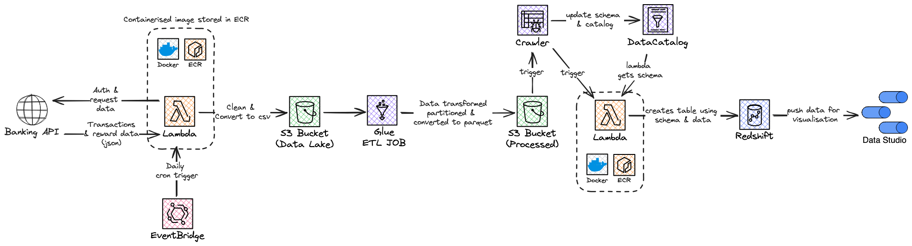

# Credit Card Cashback Data Pipeline

## Data Engineering Zoomcamp Capstone Project

### Project Description
Credit card cashback rewards are a popular feature of many credit cards.
This project is designed to provide an efficient and reliable data pipeline for analyzing credit card cashback rewards data. 
The data pipeline collects, processes, and stores data from the payment card via an API to help identify spending and reward patterns.

The core problem addressed by this project revolves around the efficient tracking and analysis of cashback rewards. 
Currently, users of the cashback card face difficulties in monitoring the status of their rewards, which can lead to a lack of clarity regarding their financial benefits. 
Without a streamlined process to track these rewards, users might not be able to optimize their spending patterns or fully leverage the benefits offered by the card.

To resolve this, the project proposes the development of a dedicated data pipeline, designed to automate the collection, processing, and storage of transaction and rewards data through the card's API. 
This pipeline will enable users to gain real-time insights into their spending and the status of their rewards. 

The automated data pipeline aims to:

- Aggregate detailed transaction data, providing a comprehensive view of spending.
- Monitor the accrual and release of cashback rewards, ensuring users have up-to-date information.
- Analyze spending patterns in conjunction with reward accumulation, offering insights for optimizing cashback potential.
- Present a clear and user-friendly interface for tracking and analysis, empowering users with actionable financial information.

[Dashboard](https://lookerstudio.google.com/reporting/1e51be85-1fee-4fee-b280-1349dffd0a28)

### Architecture

1. Extract data using Open Banking API
2. Load json into AWS S3
3. Transform using glue and lambda
4. Copy into AWS Redshift
5. Visualise data using Google Data Studio Dashboard

Orchestrate with Glue and Docker
Create AWS resources with Terraform

### Technology Stacks
- Terraform for IaC
- Lambdas, pyspark and glue crawler for batch processing
- RedShift for data warehouse
- AWS Glue for ELT and pipeline orchestration
- Looker Studio for reporting and visualization

### Data Warehouse (Redshift)

### Data Transformation (Glue/Pandas)
- Two datasets are pulled from the Open Banking API. Rewards and Transactions data. 
A left join is performed on the two datasets matching each reward with its transaction. 
This is because rewards is missing key information such as the merchant name and transaction amount.
- Updated schema and created new variables such as `reward_amount` and `plu_price` for analysis.

[//]: # (### Instructions)

[//]: # (1. Clone the repository)

[//]: # (2. Run `terraform init` to initialize the terraform directory)

[//]: # (3. Run `terraform apply` to create the resources)

[//]: # (4. )