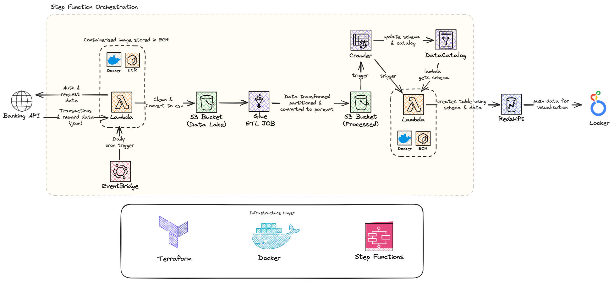
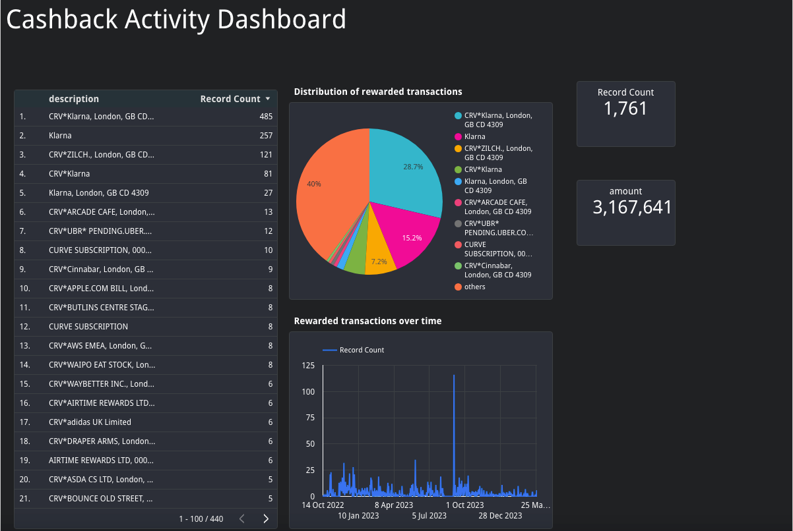
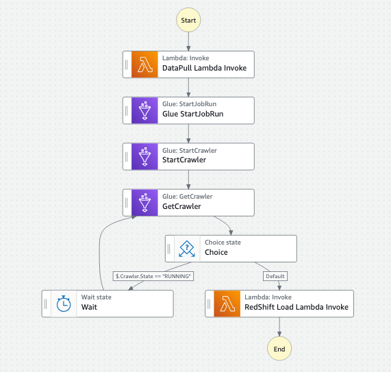
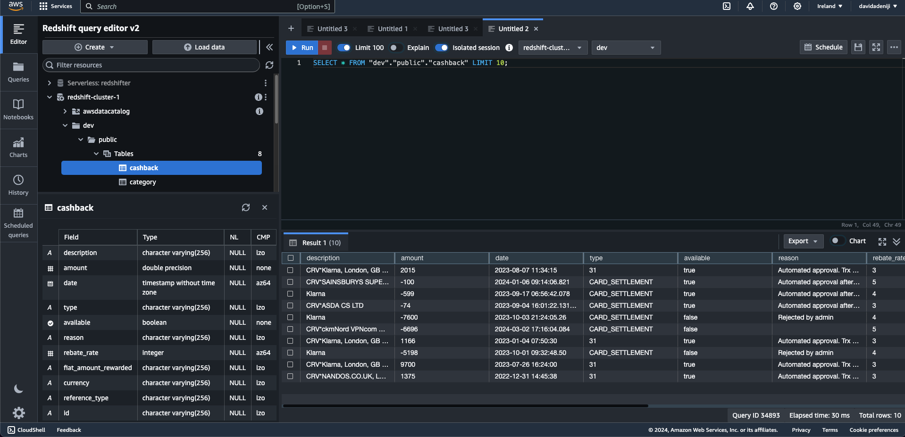

# Credit Card Cashback Data Pipeline

## Data Engineering Zoomcamp Capstone Project

### Introduction

Credit card cashback rewards are a popular feature of many credit cards.
This project is designed to provide an efficient and reliable data pipeline for analyzing credit card cashback rewards data. 
The data pipeline collects, processes, and stores data from the payment card via an API to help identify spending and reward patterns.

## Table of Contents

- [Architecture](#architecture)
- [Project Description](#project-description)
- [Dashboard](#dashboard)
- [Architecture Overview](#architecture-overview)
  - [Workflow Orchestration](#workflow-orchestration)
  - [Cloud Platform](#cloud-platform)
  - [Data Ingestion](#data-ingestion)
- [Technology](#technology)
  - [Infrastructure layer](#infrastructure-layer)
  - [Stack](#stack)
  - [Data Warehouse (Redshift)](#data-warehouse)
  - [Data Transformation (Glue/Pandas)](#data-transformation)
  - [Stack](#stack)
- [Setup](#setup)
  - [Pre-requisites](#pre-requisites)
  - [Instructions](#instructions)
  - [Tear Down](#tear-down)

## Architecture

The data pipeline consists of the following components:
1. Extract data using Open Banking API
2. Load JSON into AWS S3
3. Transform using glue and lambda
4. Copy into AWS Redshift
5. Visualise data using Google Data Studio Dashboard

Orchestrate with Glue and Docker
Create AWS resources with Terraform

### Project Description

The core problem addressed by this project revolves around the efficient tracking and analysis of cashback rewards. 
Currently, users of the cashback card face difficulties in monitoring the status of their rewards, which can lead to a lack of clarity regarding their financial benefits. 
Without a streamlined process to track these rewards, users might not be able to optimize their spending patterns or fully leverage the benefits offered by the card.

To resolve this, the project proposes the development of a dedicated data pipeline, designed to automate the collection, processing, and storage of transaction and rewards data through the card's API. 
This pipeline will enable users to gain real-time insights into their spending and the status of their rewards. 

The automated data pipeline aims to:

- Aggregate detailed transaction data, providing a comprehensive view of spending.
- Monitor the accrual and release of cashback rewards, ensuring users have up-to-date information.
- Analyze spending patterns in conjunction with reward accumulation, offering insights for optimizing cashback potential.
- Present a clear and user-friendly interface for tracking and analysis, empowering users with actionable financial information.
- Serverless architecture for scalability and cost efficiency.

Examples of data can be found at `rewards.csv` and `transactions.csv`

### Dashboard
[Dashboard](https://lookerstudio.google.com/reporting/1e51be85-1fee-4fee-b280-1349dffd0a28)

An extensive dashboard has been created using Looker, an open-source tool for business intelligence. 
This dashboard includes several sections, each providing detailed insights into different facets of rewards data such as trends, 
patterns, and irregularities. The data is presented in a visually appealing and easy-to-understand format, 
enabling spenders to better understand their expenses.

## Architecture Overview

### Workflow Orchestration

- step_functions are used to orchestrate the workflow of the data pipeline.

### Cloud Platform

The project has been completely set up and is running on Amazon Web Services (AWS) cloud platform. 
Uses Terraform, which is an infrastructure as code (IaC) tool, to provision and manage the required resources.
Uses Docker for containerization and orchestration of the Glue jobs.
This approach guarantees that the deployment process is consistent, repeatable, and scalable.

### Data Ingestion
Batch: Glue jobs and lambdas are utilized for processing raw data as batch.

### Technology

#### Infrastructure layer
- AWS
- Docker
- Terraform

#### Stack
- Terraform for IaC
- Lambdas, pyspark and glue crawler for batch processing
- RedShift for data warehouse
- AWS Glue and Step functions for ELT and pipeline orchestration
- Looker Studio for reporting and visualization

### Data Warehouse

Redshift is used as the data warehouse for the project.

### Data Transformation
- Two datasets are pulled from the Open Banking API. Rewards and Transactions data. 
A left join is performed on the two datasets matching each reward with its transaction. 
This is because rewards are missing key information such as the merchant name and transaction amount.
- Performed cleaning, updated schema and created new variables such as `reward_amount` and `plu_price` for analysis downstream.

## Setup

### Pre-requisites
- AWS Account
- AWS CLI configured with access key and secret key in `~/.aws/credentials`
- Docker
- Terraform
- Looker Account

### Instructions

1. Clone the repository
2. Add your AWS Account ID and ECR region to the `Makefile`
3. Run `make terraform/plan` to initialize the terraform directory and check resources to be created
4. Run `make terraform/apply` to create the resources. Make sure docker is running and you have the necessary permissions to push to ecr.
5. Go to the AWS Console > step functions and run the state machine
6. Get the Redshift endpoint and credentials from the AWS Console and sign into Looker to create a connection to Redshift

### Tear Down
`make terraform/plan-destroy` then `make terraform/destroy`
